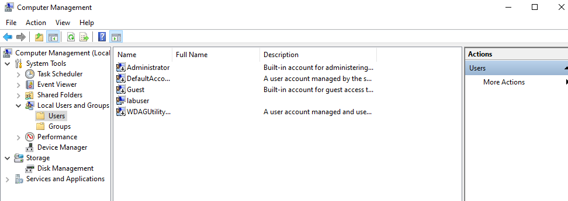
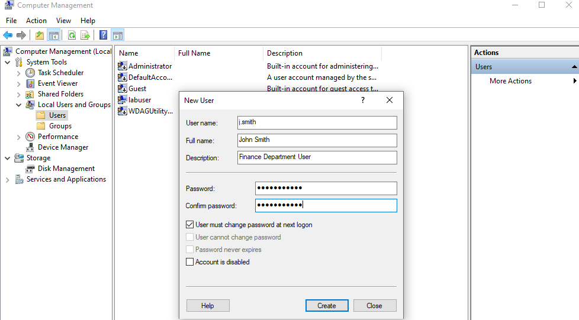
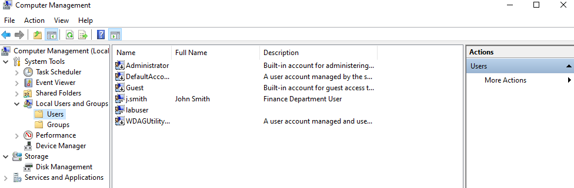
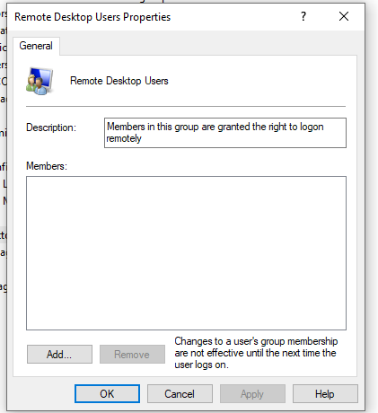
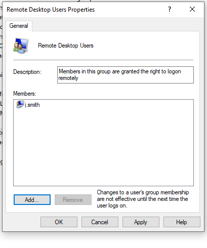

# it-support-ticket-002-create-local-user-account
Windows IT Support Lab 002 - Creating a local user account and assigning Remote Desktop access.

# 🎫 IT Support Ticket 002 – Create a Local Windows User Account

## 🎯 Objective

Create a local Windows user account for a new employee and grant Remote Desktop access by adding the user to the appropriate local security group.

## 🛠️ Tasks Performed

- Opened Computer Management.
- Navigated to Local Users and Groups.
- Created a new local user account (j.smith).
- Verified the user account was successfully created.
- Opened the Remote Desktop Users group.
- Added the user to the Remote Desktop Users group.
- Verified the group membership.

- ## 💻 Skills Demonstrated

- Windows User Management
- Local User Administration
- Windows Computer Management
- Remote Desktop Configuration
- User Account Verification
- IT Support Fundamentals
- Troubleshooting
- Technical Documentation

- ## 📚 What I Learned

This lab taught me how to create and manage local Windows user accounts using Computer Management. I also learned how to assign a user to the Remote Desktop Users security group, verify group membership, and troubleshoot issues such as incorrect usernames during user validation.

## 📌 Key Takeaway

Creating and managing local user accounts is one of the most common responsibilities of an IT Support Technician. This lab demonstrates the process of provisioning a new user, assigning appropriate access through local security groups, and verifying that the account has been configured correctly.

## 📸 Screenshots

### 1. Existing Local Users

### 2. New User Creation

### 3. User Successfully Created

### 4. Remote Desktop Users (Before)

### 5. Remote Desktop Users (After)

## 🎥 Video Demonstration

Watch the complete video walkthrough on YouTube:

▶️ https://youtu.be/vG4XiL5Nn6M
